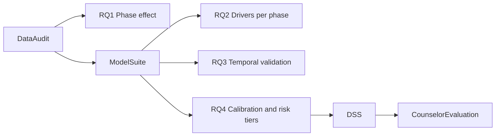

# Thesis core (Capstone C)

Working title: A Data-Driven Model for Predicting Students' Intentions to Pursue Higher Studies Abroad.

The title is unchanged. The wording below is the operational research design used from Capstone C onward. "Intention" in the title is operationalized as the agency-recorded continuation decision: whether the student stays on the study-abroad pathway after intake.

## Problem statement

Political instability in Bangladesh between 2023 and 2026 changed whether students follow through on studying abroad. We measure how much, identify which student factors matter most under each political condition, and deliver an explainable early-warning tool counselors can use.

This is not a generic classifier bake-off. The classifier is the instrument. The research objects are the political-phase effect, the stability of that effect across student profiles, and whether a model trained on past periods still works in a later period.

## Target

`Continuation` (Yes/No), stored as `Continuation_Bin`.

Recorded by the source agency at the student record. It is the decision to continue the study-abroad pathway, not a survey item invented for this thesis.

Open confirmation still required from the agency, and stated as a limitation until confirmed:

- the exact operational rule used to mark Continuation = Yes
- whether Due_Diligence (`Researched`: No, Yes Low, Yes Medium, Yes High) is recorded before that outcome

If Due_Diligence is filled in after the outcome, it is leakage and the strongest predictor cannot be used at counseling time.

## Research questions

1. RQ1. Does the political phase at intake change continuation after academic and financial profile are controlled?
2. RQ2. Which factors drive continuation, and do those drivers shift across phases?
3. RQ3. How well does a model trained on past political periods predict an unseen later period?
4. RQ4. Can an explainable, calibrated decision-support system give counselors useful risk tiers?

## Hypotheses

- H1. Continuation rates differ by political phase.
- H2. Due diligence has a monotonic positive association with continuation inside every phase.
- H3. A random train/test split overestimates performance relative to forward-in-time validation.

H3 is a methodological result about this kind of data. A drop under forward validation is a finding, not a failed model.

## Data

6,000 applicant records, five political windows, November 2023 to July 2026:

| Phase | Window used in this study |
|---|---|
| Stable | 1 Nov 2023 to 31 Mar 2024 |
| Unstable | 1 Apr 2024 to 7 Aug 2024 |
| Transitional phase 1 (first 5 months) | 8 Aug 2024 to 30 Jun 2025 |
| Transitional phase 2 (last 5 months) | 1 Sep 2025 to 31 Jan 2026 |
| Newly Elected | 15 Feb 2026 to 15 Jul 2026 |

Source files live in `Datasets/updated_datasheet/`. The in-file `Political_Phase` label is wrong for Stable (stored as "Transitional") and Newly Elected (stored as "Unstable"). The phase used in modeling is the file-level period, not that cell.

## Contribution

Core:

1. An empirical estimate of how Bangladesh's 2023-2026 political transitions relate to study-abroad continuation, with effect sizes, on a 6,000-record multi-period agency dataset.
2. Evidence on whether random-split scores overstate performance when the political period shifts (H3), with forward-validated numbers reported beside the random split.

Supporting:

- Due diligence as a graded, actionable predictor rather than a Yes/No flag.
- An explainable, calibrated decision-support system, with a counselor evaluation protocol.
- Re-implementation of two published dropout methodologies on this context. Those papers' published scores are on different datasets and are not a leaderboard against this thesis.

## What this thesis does not claim

- It does not claim to beat Carballo-Mendívil et al. (2025) or Niyogisubizo et al. (2022) on their data.
- It does not claim the model should make the continuation decision. The counselor remains the decision maker.
- It does not claim a random-split accuracy is the deployment accuracy. RQ3 is the deployment estimate.

## Research design

Figure file: `docs/research_design.png`.

Experiment map:

| ID | Question | Output |
|---|---|---|
| E1 | Is the revised dataset internally consistent? | `experiments/results/DATA_AUDIT.md` |
| E2 | RQ1, H1, H2 | phase statistics and odds-ratio plot |
| E3 | Lift over trivial baselines, with uncertainty | repeated CV and paired tests |
| E4 | RQ3, H3 | forward and leave-one-phase-out validation |
| E5 | RQ2 | phase-stratified SHAP, with E7 |
| E6 | RQ4 cutoff | calibration and precision-based tiers |
| E7 | Where the model fails | error profiles |
| E8 | Are duplicate encodings doing real work? | reduced feature comparison |
| E9 | Do cross-phase copies inflate the scores? | E3/E4 on deduplicated rows |
| E10 | Do counselors find the tool useful? | protocol in `docs/COUNSELOR_EVALUATION_PROTOCOL.md` |

## Capstone path

- Capstone A proposed predicting study-abroad intention from applicant data, using published dropout methods as the modeling frame.
- Capstone B built the pipeline, re-implemented those methods, and added ablation, SHAP, risk tiers, and the Streamlit DSS. Due diligence and political phase dominated.
- Panel feedback: the goal was unclear, and the work looked like a one-semester classifier project.
- Capstone C keeps the topic and adds the questions above: a data audit, a statistical phase effect, uncertainty, temporal validation, calibration, error analysis, and a counselor study design.
